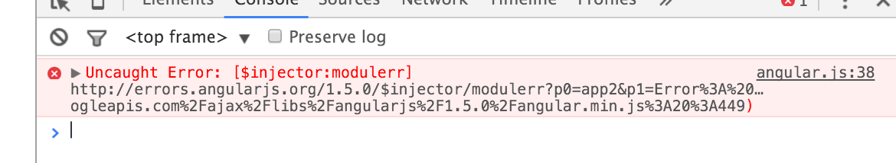
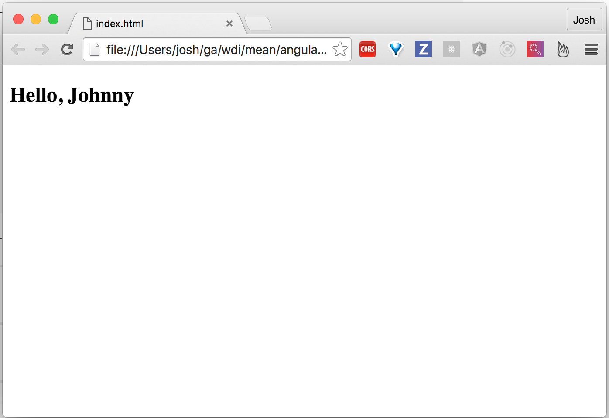

More Angular
----------

# Review
Previously we started to understand the concept of client-side MVC, and looked
at how we can use AngularJS to build our applications.

We used `Directives` and `Models` to get a very basic application that took a
user's name and displayed it in an `<h2>` tag.

To reflect back on that simple app, we learned that a `Directive` is an
extension to standard HTML, given to us by Angular. We can use them to do
several things, such as:

* tell Angular where our application starts and stops in the HTML
* Describe special attributes on existing HTML tags
* show and hide things

We also learned that a `Model` is a special type of `Directive` that allows us
to "bind" data from one area of our application to another (like we saw with the
`<input>` area and the `<h2>` tag.

# New Stuff
Building on top of that knowledge, we're going to explore some more built in
features that Angular gives us. Namely:

* `Controllers`
* `Services`
* `filters`
* and a few more special `Directives`

## A "Real" Angular App
Before we get too deep into exploring more specific Angular features, we should
take a minute to discuss how to actually write a "real" Angular app.

In our previous example, we didn't explicitly define any new JavaScript. This
can be fine for very basic applications, though you will not get very far
without getting your hands dirty with some new JavaScript.

To start with, you need to include Angular in a script tag in the `<head>` of
your HTML, like we did with the previous example.

Right below that, we should also include a JavaScript file that we create,
usually named `app.js`, as well as place the `Directive` "`ng-app='app'`" either
on the `<html>` tag or the `<body>` tag.

Here's an example of some "boilerplate" HTML for starting an Angular app:

```html
<!DOCTYPE html>
<html lang="en">
  <head>
    <meta charset="UTF-8">
    <script src="https://ajax.googleapis.com/ajax/libs/angularjs/1.5.0/angular.min.js"></script> 
    <script src="app.js"></script> 
  </head>
  <body ng-app="app">

  </body>
</html>
```

Inside of our `app.js` file, we are going to first create an "Immediate Invoked
Function Expression" (or IIFE for short).

```javascript
(function () {
  // our code goes here
})();
```

This is important for several reasons, though the biggest reason is that it
keeps all of our variables and methods from polluting the rest of the document.
If that were to happen, you might be OK for a while, but with a growing app,
things might start to break for seemingly no reason.

Imagine having a house full of people with the same name, and you're trying to
call out a specific one-- there would be a little confusion for a while. The
same thing can happen in JavaScript, though it's not always as easy to sort out.

IIFE's give us some protection from this nightmare.

The code that goes inside of our IIFE is pretty straight forward:

```javascript
(function () {
  angular
    .module('app', []);
})();
```
Here, we are calling the `angular` object given to us by including
`angular.min.js` in the previous `<script>` tag, and then defining the base
`module` that our app lives in.

In this example, our app is simply named `app`. This could be anything, really,
though it is important to make the connection between what we have called named
it in `app.js` and what we have called it in our `ng-app` directive in the HTML:
they should be identical, otherwise Angular will have no clue what you're
telling it to do.

> **Note**
> Angular is also generally nice enough to give us helpful errors when we make
> mistakes. Supposing you did misspell `app` in either `app.js` or your `ng-app`
> `Directive`, you'll get a lovely error message like this:
> 
> This might look scary at first, but notice that it gives us a link to click
> on:
> > https://docs.angularjs.org/error/$injector/modulerr?p0=app&p1=Error:%20%E2%80%A6ogleapis.com%2Fajax%2Flibs%2Fangularjs%2F1.5.0%2Fangular.min.js:20:449

Another important thing is the empty array, `[]`, that we place after the comma
in the `module` method:

```javascript
  //...           |
  //...           V
  .module('app', []);
  //...
```

In the future, you'll be listing "dependencies" in here,
which can either be built-in functionality that you'd like to use, or 3rd-party
libraries that are made to work with Angular. We'll explore more of that later.
For the time being, make sure to not forget this empty array, as Angular will
complain quite a bit without it.

## Our First Controller

To speak on a high level, a `Controller` is created by the Angular `Directive`
`ng-controller`. A `Controller` is a regular JavaScript object that allows us to
handle data contained within Angular's `$scope` object.

To bring it down a bit, lets take a look at an example of a `Controller` and see
what it lets us do.

In our `app.js` file, let's add the following code

> **app.js**
> ```diff
> (function () {
> + function MainController () {
> +   var vm = this;
> +   vm.name = "Johnny";
> + }
> 
>   angular
>     .module('app', [])
> +   .controller('mainController', MainController);
> })();
> ```

> **Note**
>
> The green lines that start with `+`'s denote what is *new* to the file

In `app.js`, we are defining a new JavaScript function called `MainController`.
Inside of `MainController`, we are assigning a variable `vm` (short for
ViewModel) to `this`.

> **Note**
>
> For small applications, `var vm = this;` might not be very important, though
> as your app grows, and the code you write in your controller gets longer, the
> meaning of `this` will start to become ambigious.
> 
> Some of this ambiguity is handled nicely with newer ES6 syntax, though let's
> stick to "best practices" in ES5 for the time being.


After we've defined `vm`, we then add a property to it called `name`, and assign
it a value of `"Johnny"`.

Next, we have to inject this `Controller` into Angular. We can do this with the
`controller` method that comes with Angular. To do this, all we need is a string
that contains the name of the `Controller` as we wish to reference it, and then
the function name passed in afterward.

In our example right now, we're referencing the controller with the string
`'mainController'`, and then passing in the proper name, `MainController`.

```javascript
  //...
  .controller('mainController', MainController);
  //...
```

With that saved, we now need to add some stuff to our HTML code:

> **index.html**
> ```diff
> <!DOCTYPE html>
> <html lang="en">
>   <head>
>     <meta charset="UTF-8">
>     <script src="https://ajax.googleapis.com/ajax/libs/angularjs/1.5.0/angular.min.js"></script> 
>     <script src="app.js"></script> 
>   </head>
>   <body ng-app="app">
> +   <div ng-controller="mainController as vm">
> +     <h2>Hello, {{vm.name}}</h2>
> +   </div>
>   </body>
> </html>
> ```

Save your work and open it up in the browser. If all went well, you should end
up with a page that looks like this:



So, what is going on here? There's a lot of new syntax going on. First things
first, `app.js`.

Then, in our HTML, we are simply asking for the value contained inside of
`vm.name` and displaying it onto the page.

## Let's Add Some More Functionality

Going with what we know about `Controller`'s, let's explore adding some new
features to our app.

The first thing we're going to look at is adding methods to our `MainController`
inside of `app.js`.


> **app.js**
> ```diff
>  (function () {
>    function MainController () {
>      var vm = this;
> -    vm.name = "Jonny";
> +    vm.count = 0;
>
> +    vm.reset = function () {
> +      vm.count = 0;
> +    }
>
> +    vm.increment = function () {
> +      vm.count++;
> +    }
>
> +    vm.decrement = function () {
> +      vm.count--;
> +    }
> +  }
>
>    angular
>      .module('app', [])
>      .controller('mainController', MainController);
>  })();
> ```
>
> **Note:**
> The red lines starting with `-` tell us what we're deleting in our changes

All we've done here is attached three functions to our `vm`:

* `reset()`
* `increment()`
* `decrement()`

and attached a new variabled called `count` to our `vm` that contains the
current count. `increment()` and `decrement()` add to and remove 1 from the
`count`, and `reset()` does what it sounds like-- it resets the `count` back to
0.

Now that we've added the logic for a simple counter to `app.js`, we need to wire
the functionality into our HTML

> **index.html**
> ```diff
> <!DOCTYPE html>
> <html lang="en">
>   <head>
>     <meta charset="UTF-8">
>     <script src="https://ajax.googleapis.com/ajax/libs/angularjs/1.5.0/angular.min.js"></script> 
>     <script src="app.js"></script> 
>   </head>
>   <body ng-app="app">
>     <div ng-controller="mainController as vm">
> -     <h2>Hello, {{vm.name}}</h2>
> +     <h2>Counter App</h2>
>
> +     <div>{{vm.count}}</div>
> 
> +     <button ng-click="vm.increment()">+</button>
> +     <button ng-click="vm.decrement()">-</button>
> +     <button ng-click="vm.reset()">reset</button>
>     </div>
>   </body>
> </html>
> ```

Let's take a second to go over what we're doing in the HTML. The reference to
`vm.name` is now `vm.count`, which reflects the `vm.count` we defined in
`app.js`. This is going to initially be set to 0, and will show up on the
website as 0

Secondly, we've added some buttons with `ng-click` `Directives`. Inside of these
`ng-click`'s, we've specified our `Controller` methods:

* `vm.increment()`
* `vm.decrement()`
* `vm.reset()`


