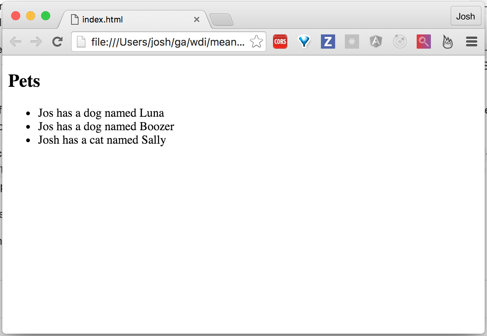

Even More Angular!
----------

# Review

In the previous section, we learned a lot more about how to structure the pieces
of our application, both in `app.js` and in `index.html`. We also explored some
more functionality available to us with `Directives` and how to utilize
`Controllers` to some extent.

When we're building our Angular applications, its best to start simply and build
our way upward and make changes according to our own needs. By learning more
about the architecture that Angular gives us, we can make informed decisions
that will help prevent us from problems in the future.

# Services

When working with apps, the idea of a data source comes up. Whether its from a
database or a hard-coded object or array, it needs to live somewhere.

With this section, we're going to work on a simple app to showcase pets and
who owns them. We will start by keeping the data in our `Controller` and then
eventually migrating it into what Angular calls a `Service`.

From a high level

Starting with a new `app.js` and a new `index.html`, we can get to work.

Here is the boilerplate code we're going to be starting with:

> **app.js**
> ```javascript
> (function () {
>   angular
>     .module('petsApp', [])
> })();
> ```

> **index.html**
> ```html
> <!DOCTYPE html>
>   <html lang="en">
>     <head>
>       <meta charset="UTF-8">
>       <script src="https://ajax.googleapis.com/ajax/libs/angularjs/1.5.0/angular.min.js"></script> 
>       <script src="app.js"></script>
>     </head>
>   <body ng-app="petsApp">
>   </body>
> </html>
> ```

First, let's add a new `Controller` to `app.js` called `PetsController`:

> **app.js**
> ```diff
> (function () {
> + function PetsController () {
> +   var vm = this;
> +   vm.pets = [
> +     {name: 'Luna', type: 'dog', owner: 'Jos', gender: 'female'},
> +     {name: 'Boozer', type: 'dog', owner: 'Jos', gender: 'male'},
> +     {name: 'Sally', type: 'cat', owner: 'Josh', gender: 'female'}
> +   ];
> + }
> 
>   angular
>     .module('petsApp', [])
> +   .controller('petsController', PetsController');
> })();
> ```

Here, we've created a very simple `Controller` that just contains a list of
pets. We've also injected it into our Angular app through the `controller`
method and given it the name `'petsController'`.

Next, lets work on our HTML and adding `Directives` to display our data:

> **index.html**
> ```diff
> <!DOCTYPE html>
>   <html lang="en">
>     <head>
>       <meta charset="UTF-8">
>       <script src="https://ajax.googleapis.com/ajax/libs/angularjs/1.5.0/angular.min.js"></script> 
>       <script src="app.js"></script>
>     </head>
>   <body ng-app="petsApp">
> +   <div ng-controller="petsController as vm">
> +     <h2>Pets</h2>
> +     <ul>
> +       <li ng-repeat="pet in vm.pets | orderBy : 'owner'">
> +         {{pet.owner}} has a {{pet.type}} named {{pet.name}}
> +       </li>
> +     </ul>
> +   </div>
>   </body>
> </html>
> ```

There's a lot more magic happening in our HTML this time. Starting in familiar
territory, though, we're using our `ng-controller` directive to use our
`petsController` and alias it as `vm`.

In our `<li>` element we're taking advantage of another great `Directive` that
Angular gives us out of the box: `ng-repeat`. If you're used to writing our
loops and know what they do, the `ng-repeat` directive behaves very similarly to
JavaScript's `for...in` or `.forEach()` loop.

On the face of it, we're iterating over the `vm.pets` array. Each item in the
array is aliased to `pet`, which we can then use inside of the loop to display
bits of information, such as `pet.name` or `pet.owner`.

While still discussing `ng-repeat` as we've used it, you may also notice the `|`
and the words `orderBy : 'owner'`-- the `|` is called a `Filter`, and `orderBy`
is a built in `Filter` that takes an array of Objects and arranges them
according to the argument supplied to it.

In our instance, we're telling Angular to order the pets alphabetically by the
owner's name.

How cool is that?

If we view it in the browser, it should look something like this:



